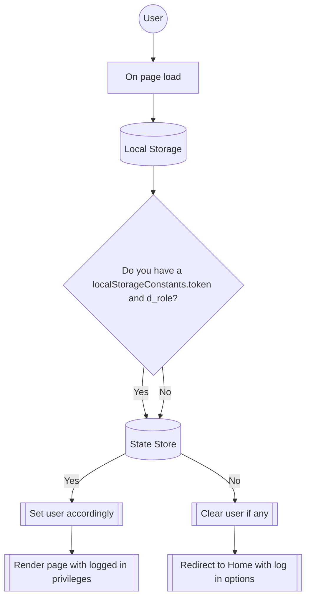
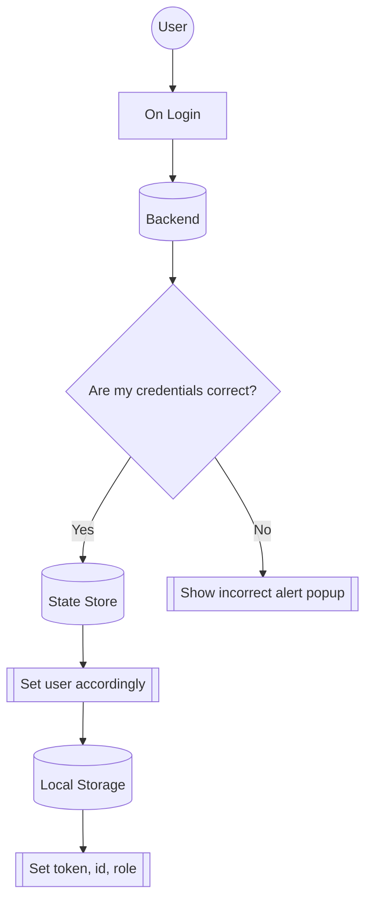

### Diagram for authentication check

```mermaid.js
flowchart TD
    U((User))
    L[(Local Storage)]
    S[(State Store)]
    U --> ask[On page load] --> L --> Q{Do you have a localStorageConstants.token and d_role?}
    Q --> |Yes| S -- Yes --> setUser[[Set user accordingly]] --> render1[[Render page with logged in privileges]]
    Q --> |No| S -- No --> clearUser[[Clear user if any]] --> render2[[Redirect to Home with log in options]]
```

### Diagram for login

```mermaid.js
flowchart TD
    U((User))
    L[(Local Storage)]
    S[(State Store)]
    B[(Backend)]
    U --> ask[On Login] --> B --> Q{Are my credentials correct?}
    Q --> |Yes| S --> setUser[[Set user accordingly]] --> L --> setLocalStorage[[Set token, id, role]]
    Q --> |No| render2[[Show incorrect alert popup]]
```
